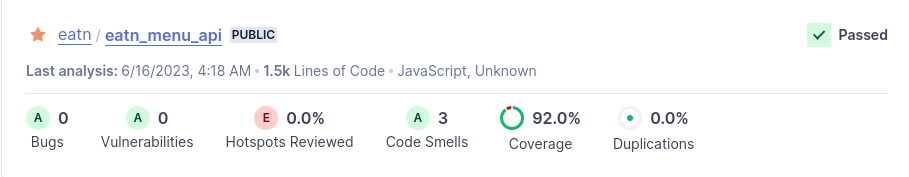
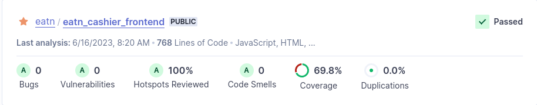

# Code quality

- [Code quality](#code-quality)
  - [Intro](#intro)
  - [Tooling and methodology](#tooling-and-methodology)
  - [How is code quality gauged?](#how-is-code-quality-gauged)
  - [How do I gauge my code quality?](#how-do-i-gauge-my-code-quality)
  - [Programmatic code quality checking](#programmatic-code-quality-checking)
    - [Unit testing](#unit-testing)
    - [Integration testing](#integration-testing)
    - [Static code analysis](#static-code-analysis)


---

## Intro

*You use software tooling and methodology that continuously monitors and improve the software quality during software development.*

## Tooling and methodology

*Carry out, monitor and report on unit integration, regression and system tests, with attention for security and performance aspects, as well as applying static code analysis and code reviews.*

## How is code quality gauged?

Code quality can be both objective and subjective rating, meaning it can be assessed both my a machine to check for standard noncompliance, security risks, code duplications, but also it can be assessed by human eye for so-called "code smells". Code quality is usually both machine's and human's job and both parties fill each other's weakness during code analysis.

## How do I gauge my code quality?

My main way of gauging code quality is peer review and static code analysis. If I notice some indications of possible refactoring, I usually ask my peers and colleagues before pulling the trigger. But if I notice various changes that are negligible or so miniscule only static analysis tools notice, I take the initiative and improve upon it.

But there always has to be a constant reassurance that some piece of code works properly to continue developing. Manual tests and very frequent peer reviews can be cumbersome and quite tiring. 

That's where tests come in. Tests make sure your code behave properly no matter the data, circumstances or environment.

## Programmatic code quality checking

In my project I implemented 3 different ways of quality assurance: [unit testing](#unit-testing), [integration testing](#integration-testing), and [static code analysis](#static-code-analysis)

### Unit testing

Unit testing is a software testing approach that involves testing individual units of code in isolation. It is focused on verifying the correctness and functionality of small, self-contained components such as functions or methods. By testing units independently, unit tests helps identify defects early in the development process, allowing for quicker debugging and reducing the risk of issues in larger system integrations. Ultimately, unit testing plays a crucial role in improving code quality, ensuring reliable and maintainable software.

To cover these grounds, I tested one part of Menu API to ensure that data flow is correct, API serves correct data and API behaves correctly when given improper data.

```
$ npm run test

> menu_items@1.0.0 test
> jest

 PASS  tests/categoryRouter.test.js
  Category router
    Create new category
      ✓ Successful scenario (58 ms)
      ✓ Invalid request body format scenario (17 ms)
      ✓ Duplicate name scenario (21 ms)
    Get all categories
      ✓ No categories present scenario (22 ms)
      ✓ One category present scenario (18 ms)
      ✓ Multiple categories present scenario (19 ms)
    Get category by id
      ✓ Successful scenario (14 ms)
      ✓ Invalid id format scenario (15 ms)
      ✓ Nonexistent id scenario (11 ms)
    Update category by id
      ✓ Successful scenario (14 ms)
      ✓ Invalid id format scenario (8 ms)
      ✓ Invalid request body format scenario (8 ms)
      ✓ Nonexistent id scenario (9 ms)
      ✓ Duplicate name scenario (14 ms)
    Delete category by id
      ✓ Successful scenario (11 ms)
      ✓ Invalid id format scenario (7 ms)
      ✓ Nonexistent id scenario (8 ms)

Test Suites: 1 passed, 1 total
Tests:       17 passed, 17 total
Snapshots:   0 total
Time:        1.574 s
Ran all test suites.
```

### Integration testing

Integration testing is a software testing technique that verifies the interactions and interfaces between different modules or components of an application. It aims to uncover issues that arise when the units are combined and tested as a group. Integration testing focuses on ensuring the seamless integration and communication between various components, including APIs, databases, and external systems. It helps identify defects in the interaction between these components, validates data flow, and ensures the overall functionality and reliability of the integrated system.

To cover this part of testing, I tested most used web components which handle, process and interact with large amounts of external data. To ensure proper behaviour, these pieces of code are tested to make sure they act correctly during data transfer.

```
$ npm run test

> cashier-frontend@0.0.1 test
> vitest run --coverage

 ✓ tests/Pill.test.js (5)
 ✓ tests/TagDropdown.test.js (5)

 Test Files  2 passed (2)
      Tests  10 passed (10)
   Start at  08:09:33
   Duration  3.08s (transform 872ms, setup 480ms, collect 1.76s, tests 192ms)
```

### Static code analysis

Static code analysis is a technique used to analyze source code without executing it. It helps identify potential issues, vulnerabilities, and violations of coding standards. By examining the code structure, syntax, and patterns, static code analysis tools can provide developers with automated feedback to improve code quality, security, and maintainability.

To take advantage if this tool, I used Sonar Cloud to progammatically analyse every new incoming code. It is triggered by the pipeline when new code is pushed. To read more about pipeline setup, click [here](./4_cicd.md).





