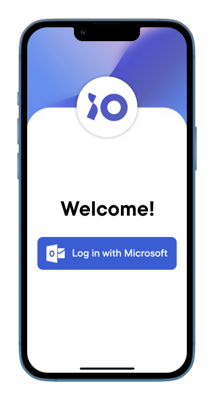
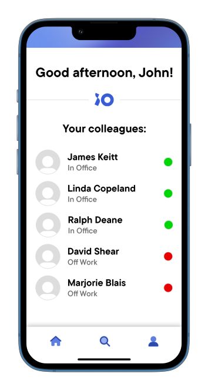
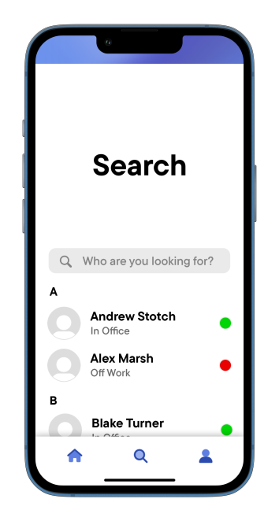
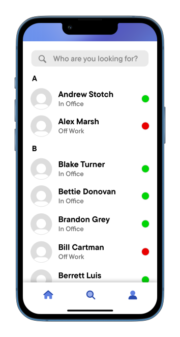
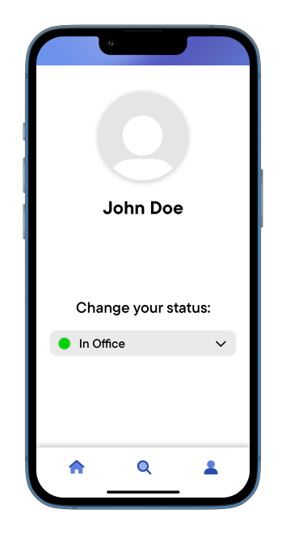

# Requirements and design

---

- [Requirements and design](#requirements-and-design)
  - [Disclaimer](#disclaimer)
  - [Intro](#intro)
    - [Multiple types of test techniques](#multiple-types-of-test-techniques)
  - [Requirements](#requirements)
  - [Designs](#designs)
    - [UI/UX prototypes](#uiux-prototypes)
    - [Wi-Fi Tracking design](#wi-fi-tracking-design)

## Disclaimer

This document focuses on efforts on our **Group project**.

## Intro

*You analyze (non-functional) requirements, elaborate (architectural) designs and validate them using multiple types of test techniques.*

### Multiple types of test techniques

*You apply user acceptance testing and stakeholder feedback to validate the quality of the requirements. You evaluate the quality of the design (e.g., by testing or prototyping) taking into account the formulated quality properties like security and performance.*

## Requirements

Our project is built in collaboration with [IO Digital](https://www.iodigital.com/en) and their technical requirements for this project were strict.

These were the initial project requirements that were set during 1st sprint kickoff meeting: 
- The accessability of this project has to be high so every employee can access it, so only mobile application fits this requirement
- The mobile app needs to be performant, developed fast and responsive
- The compiled version of the app mustn't run on WebView, WebKit or any trimmed version of mobile browsers
- We mustn't store any sensitive data ourselves, 3rd party identity providers can be used to combat this (GDPR compliance)

Non-technical requirements set by IO were not set in stone:

- Office days once a week (group members come to company offices and we get to experience office environment)
- Standups are done on a weekly basis
- After every sprint review is followed by sprint kickoff

## Designs

During our collaboration with IO, we made a lot of designs and all those designs had different purposes and methods of validation.

### UI/UX prototypes

Our mobile app required a lot of UI/UX prototypes because if mobile is designed poorly, users aren't going to enjoy interacting with it and it won't get much usage afterall.

Our UI designs are first reviewed by other group members to we make sure that each design looks the best it can but also, we would not waste time by trying to `slice` some designs that are too difficult or complex. After peer review, we create a ticket on Jira and assign and ping Product Owner so we can get his approval on the design.

After he greenlights the prototypes, we slice it and make it functional and those interfaces end up in that sprint's application build. The application build is uploaded to Fireship App Distribution and it is distrubuted to several IO employees which give us feedback. That feedback is implemented and presented in sprint review.

| Prototype | Prototype location |
|:---:|:---:|
|  | Login page |
|  | Home page |
|  | Search page #1 |
|  | Search page #2 |
|  | Profile page | 

### Wi-Fi Tracking design

One of the features that was requested by IO was Wi-Fi device tracking in the offices. As you can imagine, accessing data for tracking and actual employee tracking dances on the edge of ethics and legality. Therefore, a document was made for legal department of IO for explaining how sensitive data is going to be used.  The document displays how the sensitive data is being transferred, how it's being used and how it is disposed off.

This document was written in cooperation with IO's developers, and they also reviewed and approved the document before forwarding it to legal department.

Click [here](../api_design/Trackio_WiFI_legal.pdf) to inspect the document.
