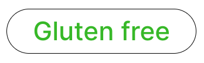
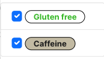
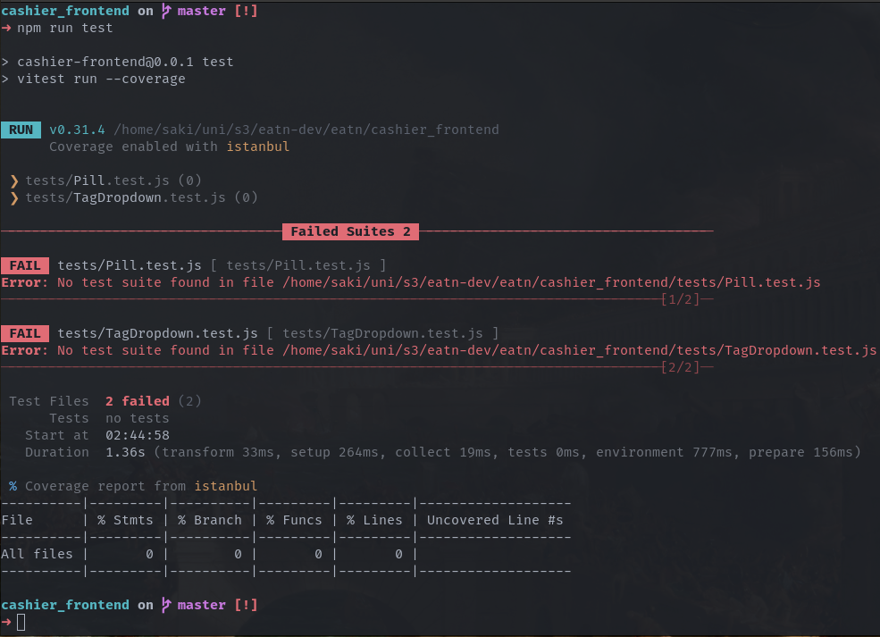
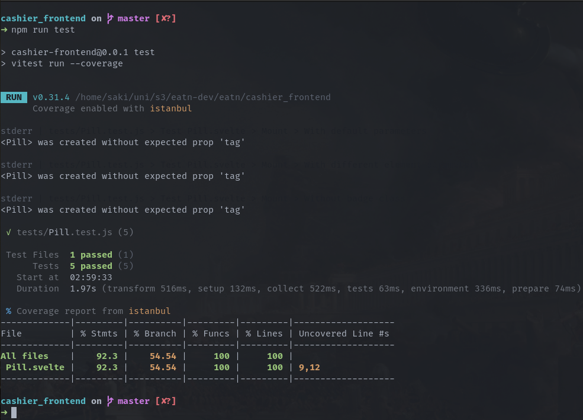
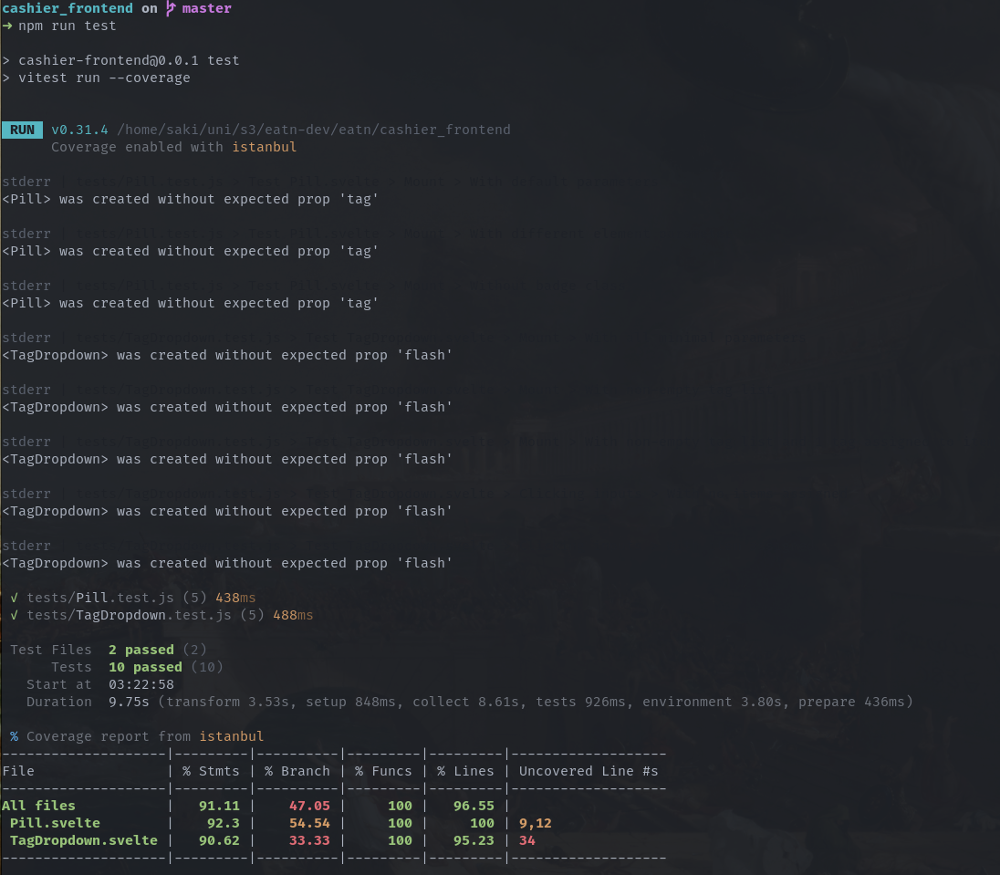

# Sveltekit integration testing

- [Sveltekit integration testing](#sveltekit-integration-testing)
  - [Introduction](#introduction)
  - [What are integration tests?](#what-are-integration-tests)
  - [Why is integration testing so important](#why-is-integration-testing-so-important)
  - [How does integration testing differ from other testing approaches, such as unit testing or system testing?](#how-does-integration-testing-differ-from-other-testing-approaches-such-as-unit-testing-or-system-testing)
  - [How to test a website written in Sveltekit?](#how-to-test-a-website-written-in-sveltekit)
    - [Installing dependencies](#installing-dependencies)
      - [Testing](#testing)
      - [Linters / Type checkers (*optional*)](#linters--type-checkers-optional)
    - [Configuring vitest](#configuring-vitest)
    - [Writing tests](#writing-tests)
  - [What are the real world implications of integration testing?](#what-are-the-real-world-implications-of-integration-testing)
  - [What are the advantages and disadvantages of integration testings?](#what-are-the-advantages-and-disadvantages-of-integration-testings)
  - [Are there any alternatives to integration tests?](#are-there-any-alternatives-to-integration-tests)
  - [References](#references)

## Introduction

This practical research paper primarily focuses on how to do integration testing using Sveltekit and tooling built around it. It will guide you how to setup your project tests, how to setup tests, how to run them and how to gather a report following those tests.

The purpose of this paper is to give back to community, as when I was trying to write integration tests

*This research is done using the DOT framework and utilizing its strategies and methods, predominantly using "Library" and "Workshop" methods.[^1]*


## What are integration tests?

Integration testing is a vital part of software development, focusing on testing the interactions between different components or systems. It ensures that various parts of an application integrate seamlessly, regardless of the technology stack used. By simulating real-world scenarios, integration testing identifies and prevents integration-related bugs, ensuring the correct functioning of the application as a cohesive unit.

## Why is integration testing so important

Integration testing is crucial for multiple reasons. Firstly, it helps uncover potential defects that may go unnoticed during unit testing. It verifies that integrated components work together correctly and meet the functional requirements of the application. Secondly, it promotes collaboration among team members by ensuring compatibility and interoperability of their respective modules within the larger system. Ultimately, integration testing enhances the reliability and overall behavior of the application, instilling confidence in its functionality.

## How does integration testing differ from other testing approaches, such as unit testing or system testing?

Integration testing differs from other testing approaches such as unit testing and system testing in terms of its primary focus and scope. While unit testing primarily verifies the correctness of individual components in isolation, integration testing specifically targets the interactions and interfaces between these components. 

Integration testing goes beyond system testing, which evaluates the overall behavior of the complete system, by specifically addressing the integration points. Unlike unit testing that ensures the internal functionality of components and system testing that assesses the system as a whole, integration testing aims to validate the seamless interaction and compatibility between integrated components. 

By focusing on integration, this type of testing helps identify and resolve issues related to data flow, communication protocols, compatibility, and interface mismatches that may not be captured by unit or system testing.

## How to test a website written in Sveltekit?

**NOTE**: This guide is written for Sveltekit project written on Sveltekit version 1.0.0-next.587; if some parts of the guide don't work, plese refer to the latest documentation.

For the educational purposes, I will use code snippets from my university project that is available [here](https://github.com/eatn-dev).

To successfully do integration testing, you have to have a piece of code that integrates with some external data and which behaviour relies on external data. In this guide test will focus on two components, **Pill** and **TagDropdown**. 

Pill component is just a div which serves as a display for Menu items'[^2] Tags[^3]. It's rendered state depends on data provided by Tag model.

TagDropdown is a dropdown menu which displays all the available tags provided by the Menu API[^4]. Its purpose is to allow adding and removing individual tags from menu items upon clicking the checkbox near the tag in the dropdown menu. It also shows which tags are assigned and which are not via the checkbox.

<br>
*Pill component rendered*

<br>
*TagDropdown component rendered*

<br>

As you can see, Pill component is rendered inside TagDropdown. That means if we integrate pill successfully on its own, it should render and behave as imagined.

### Installing dependencies

Firstly, we need to install some packages that we will use for testing.

#### Testing

- **vitest**: Sveltekit compiler is built on top of Vite[^5] and its tooling is pretty well developed so it doesn't make sense to introduce any other compilers

- **jsdom**: Emulator for WHATWG, DOM and HTML standards outside the browsers written in pure Javascript

- **@vitest/coverage-istanbul**: Istanbul is a well established coverage gatherer and reporter and vitest has subpackage for integrating Istanbul

- **@testing-library/svelte**: Testing-library subpackage that provides custom implementations, assertions and test suites for Svelte

- **@testing-library/jest-dom** : Testing-library subpackage tahat provides custom Jest[^6] assertions for testing web components

#### Linters / Type checkers (*optional*)

- **@types/testing-library__jest-dom**: Library that provides autocomplete and method definitions for some custom assertions provided by `@testing-library/jest-dom`
  
- **eslint-package-jest-dom**: Eslint[^7] plugin for `jest-dom` style enforcing, autocomplete and formatting

- **eslint-package-testing-library**: Eslint[^7] plugin for `testing-library` style enforcing, autocomplete and formatting

### Configuring vitest

To be able to run vitest, we have to configure it to gather coverage and to set `jsdom` as our component rendering emulator.

Your `vite.config.js` should look something like this:

```js
import { sveltekit } from '@sveltejs/kit/vite';

/** @type {import('vite').UserConfig} */
const config = {
	plugins: [sveltekit()],
	test: {
		globals: true,
		environment: "jsdom",
		setupFiles: "./tests/setup.js",

		coverage: {
			provider: "istanbul",
			reporter: ["text", "html", "json", "lcov"]
		}
	}
};

export default config;
```

I'll briefly explain the config:

- `globals: true`: this line will enable all tests files to implicily import `jest` methods and objects into the global environment

- `environment: "jsdom"`: this will make sure rendering of the componets is done in `jsdom` emulator which is what allows integration testing without the browser

- `setupFiles`: this property will set the file that is executed before any test is executed, and this file is used for some global test setup and config and will later in guide make more sense

- `coverage`: this config value is responsible for coverage gathering and reporting, mainly for selecting the coverage reporter and coverage report formats

After that is vitest config file is taken care of, let's come back to `setupFiles` property we previously mentioned. Setup file is the file that will be used to extend jest assertions and to have a cleanup method after each test.

We will create a folder `tests` in our root project directory, and create file `setup.js` (*if you want a setup file to be placed somewhere else or to name it something else, make sure you specify it in the config file.*).

That file will look something like this:

```js
import { afterEach } from "vitest"
import { cleanup } from "@testing-library/svelte"
import "@testing-library/jest-dom/extend-expect"

afterEach(() => {
    cleanup()
})
```

All this file does is it extends the regular `jest` assertions with ones from `jest-dom`[^7], and it defines a hook that triggers after each test which calls `cleanup()` method that makes sure rendering enviroment is clean for next test.

And the final piece of puzzle is actually invoking the test runner `vitest`. We can easily create a command in our `package.json` that runs tests and gathers test coverage.

Your `package.json` scripts section should look like this:

```json
"scripts": {
  // all your previous scrips and commands...
  "test": "vitest run --coverage"
}
  ```

### Writing tests

At this point, all the configuration is setup and you should be able to create any test file and run the the empty test files. If you type the follwing command in the terminal:

```
$ npm run test
```

You should get a message that looks something like this:



Alongside with the message, you should be able to see a `coverage` folder create in your project root directory. That's the folder that houses latest tests' report.

Let's create a `Pill.test.js` file in `tests` directory where we will test the rendering of our Pill component.

```js
// ./tests/Pill.test.js

import Pill from "../src/lib/Pill.svelte"
import { describe, test, expect } from "vitest"
import { render } from "@testing-library/svelte"

/**@type {import("@testing-library/jest-dom")} */
describe("Test Pill.svelte", () => {
    describe("Mount", () => {
        test("With default parameters", () => {
            const { container } = render(Pill)

            const span = container.querySelector("span")

            expect(span).not.toBeNull()
            expect(span).toHaveClass("pill")
            expect(span).toHaveStyle({color: "#000000"})
            expect(span).toHaveStyle({backgroundColor: "#ffffff"})
        })

        test("With different element parameter", () => {
            const element = "h1"
            const { container } = render(Pill, { props: { element: element }})

            const span = container.querySelector(element) 

            expect(span).not.toBeNull()
            expect(span).toHaveClass("pill")
        })

        test("Without badge class", () => {
            const { container } = render(Pill, { props: { isBadge: false }})

            const span = container.querySelector("span")

            expect(span).not.toBeNull()
            expect(span).toHaveClass("pill")
            expect(span).not.toHaveClass("badge")
        })

        test("With different color parameteres")
    })

    test("With different color parameters", () => {
        const tag = {
            fgColor: "#123123",
            bgColor: "#abcabc"
        }
        const { container } = render(Pill, { props: { tag: tag }})

        const span = container.querySelector("span")

        expect(span).not.toBeNull()
        expect(span).toHaveStyle({color: tag.fgColor})
        expect(span).toHaveStyle({backgroundColor: tag.bgColor})
    })
})
```

If you look closely, you will see this line:

```js
/**@type {import("@testing-library/jest-dom")} */
```

Sadly, on some linux installations eslint or autocomplete will not recognise custom `jest-dom` assertions that we exteded jest with. This makes sure it is recognised by your autocomplete provider.

If you try to run the tests now, you will see the input like this:



**Congratulations! Your first test suite has been successfully ran!**

If for some reason you have issues with testing your own components, you can import object `screen` from `@testing-library/svelte` and call `screen.debug()` which will print the DOM state at the point in the test and you can see how it's being rendered.

```html
<!-- screen.debug() output -->
<body>
  <div>
    <span
      class="badge rounded-pill pill s-OwxhjRBjLNnR"
      style="color: rgb(18, 49, 35); background-color: rgb(171, 202, 188);"
    >
      undefined
    </span>

  </div>
</body>
```

Let's continue with testing TagDropdown component and testing mouse click events:

```js
// ./tests/TagDropdown.test.js
import TagDropdown from "../src/lib/TagDropdown.svelte"
import { describe, test, expect, vi } from "vitest"
import { render, fireEvent, waitFor } from "@testing-library/svelte"
// import { screen } from "@testing-library/svelte"

global.fetch = vi.fn()
    .mockResolvedValueOnce({
        ok: true,
        json: async () => {
            return Promise.resolve(
                {
                    message: "Tag assigned successfully."
                }
            )
        }
    })
    .mockResolvedValueOnce({
        ok: true,
        json: async () => {
            return Promise.resolve(
                {
                    message: "Tag removed successfully."
                }
            )
        }
    })

/**@type {import("@testing-library/jest-dom")} */
describe("Test TagDropdown.svelte", () => {
    describe("Mount", () => {
        test("With all minimal parameters", () => {
            // arrange
            const item = {
                id: 1,
                name: "Test item",
                tags: []
            }

            const tags = []

            // act
            const { container } = render(TagDropdown, {
                props: {
                    item: item,
                    itemTags: item.tags,
                    tags: tags
                }
            })

            // assert
            const dropdown = container.querySelector(".dropdown-menu")

            expect(dropdown).not.toBeNull()
            expect(dropdown.querySelector(".list-group")).toBeEmptyDOMElement()
        })

        test("With non-empty tag list", () => {
          // arrange
            const item = {
                id: 1,
                name: "Test item",
                tags: []
            }

            const tags =  [
                {
                    id: 1,
                    name: "Test tag",
                    fgColor: "#000000",
                    bgColor: "#ffffff"      
                },
                {
                    id: 2,
                    name: "Test tag #2",
                    fgColor: "#ffffff",
                    bgColor: "#000000"
                }
            ]

            // act
            const { container } = render(TagDropdown, {
                props: {
                    item: item,
                    itemTags: item.tags,
                    tags: tags
                }
            })

            // assert
            const dropdown = container.querySelector(".dropdown-menu")

            expect(dropdown).not.toBeNull()
            expect(dropdown.querySelector(".list-group")).not.toBeEmptyDOMElement()
            expect(dropdown.querySelector(".list-group").childNodes.length).toBe(2)
        })

        test("With non-empty tag list and 1 tag assigned to item", () => {
            // arrange
            const item = {
                id: 1,
                name: "Test item",
                tags: [
                    {
                        id: 1,
                        name: "Test tag",
                        fgColor: "#000000",
                        bgColor: "#ffffff"      
                    }
                ]
            }

            const tags =  [
                {
                    id: 1,
                    name: "Test tag",
                    fgColor: "#000000",
                    bgColor: "#ffffff"      
                },
                {
                    id: 2,
                    name: "Test tag #2",
                    fgColor: "#ffffff",
                    bgColor: "#000000"
                }
            ]

            // act
            const { container } = render(TagDropdown, {
                props: {
                    item: item,
                    itemTags: item.tags,
                    tags: tags
                }
            })
            
            // assert
            const dropdown = container.querySelector(".dropdown-menu")
            const assignedTagInput = dropdown.querySelector(".list-group").querySelector(`#tag-${tags[0].id}`)

            expect(dropdown).not.toBeNull()
            expect(dropdown.querySelector(".list-group")).not.toBeEmptyDOMElement()
            expect(dropdown.querySelector(".list-group").childNodes.length).toBe(2)
            expect(assignedTagInput.checked).toBe(true)
        })
    })

    describe("Clicking inputs", () => {
        test("With no items assigned", async () => {
            // arrange
            const item = {
                id: 1,
                name: "Test item",
                tags: []
            }

            const tags =  [
                {
                    id: 1,
                    name: "Test tag",
                    fgColor: "#000000",
                    bgColor: "#ffffff"      
                },
                {
                    id: 2,
                    name: "Test tag #2",
                    fgColor: "#ffffff",
                    bgColor: "#000000"
                }
            ]

            // act
            const { container } = render(TagDropdown, {
                props: {
                    item: item,
                    itemTags: item.tags,
                    tags: tags
                }
            })
            
            const dropdown = container.querySelector(".dropdown-menu")
            const assignedTagInput = dropdown.querySelector(".list-group").querySelector(`#tag-${tags[0].id}`)
            
            await fireEvent.click(assignedTagInput)
            
            // assert
            await waitFor(()=> {
                expect(dropdown.querySelector(".list-group")).not.toBeEmptyDOMElement()
                expect(assignedTagInput.checked).toBe(true)
            }, { container: container })
        })
    })

    describe("Clicking inputs", () => {
        test("With item assigned", async () => {
            // arrange
            const item = {
                id: 1,
                name: "Test item",
                tags: [
                    {
                        id: 1,
                        name: "Test tag",
                        fgColor: "#000000",
                        bgColor: "#ffffff"      
                    }
                ]
            }

            const tags =  [
                {
                    id: 1,
                    name: "Test tag",
                    fgColor: "#000000",
                    bgColor: "#ffffff"      
                },
                {
                    id: 2,
                    name: "Test tag #2",
                    fgColor: "#ffffff",
                    bgColor: "#000000"
                }
            ]

            // act
            const { container } = render(TagDropdown, {
                props: {
                    item: item,
                    itemTags: item.tags,
                    tags: tags
                }
            })
            
            const dropdown = container.querySelector(".dropdown-menu")
            const assignedTagInput = dropdown.querySelector(".list-group").querySelector(`#tag-${tags[0].id}`)
            
            await fireEvent.click(assignedTagInput)
            
            // assert
            await waitFor(()=> {
                expect(dropdown.querySelector(".list-group")).not.toBeEmptyDOMElement()
                expect(assignedTagInput.checked).toBe(false)
            }, { container: container })
        })
    })
})
```

You can notice that in the second part of the main test suite mouse click events are tested and this is the crucial part that I would like to focus on because it gave me the most trouble.

Because of the `jest-dom` being written in pure Javascript, mouse click events are fired **asynchronously**. That is crucial to point out because once the method is called, it is called once the event loop[^8] frees up and that means there is no synchonous way to test if mouse click event is fired during assertion.

That's where `waitFor()`[^9] method comes into play. In its core, it works like this: it will run the provided callback until the callback does not throw any errors and until the test times out. Therefore, the callback is used to assert the button is being clicked.<br>
If the assertion never succeeds, the callback will throw assertion errors until the test times out. That means that your component click event handle method does not work properly and you need to fix it.<br>
Once the assertion succeeds, the code flow will exit out of the assertion loop and render the test successful.

Second important thing to point out in my case is that my component click event handle method is calling `fetch()` method. In integration/component testing, common practice is any external services, provideres, unit and components are removed to isolate the sole component to test its core functionality, therfore any call to some external service or unit is assumed to succeed. If you have some part of the code for handling of the failed requests that you'd like to test explicily, you can imitate those requests too. To imitate the successfull fetch call, we need to replace it with our custom fetch resolver that imitates the successful response.

```js
global.fetch = vi.fn()
    .mockResolvedValueOnce({
        ok: true,
        json: async () => {
            return Promise.resolve(
                {
                    message: "Tag assigned successfully."
                }
            )
        }
    })
    .mockResolvedValueOnce({
        ok: true,
        json: async () => {
            return Promise.resolve(
                {
                    message: "Tag removed successfully."
                }
            )
        }
    })
```

This code is used to do exactly that. You will see that there are 2 imitated responses. That is required in this case as the API component is contacting can have 2 different responses depending on the data that is present in the API database. Therefore I'm using `mockResolvedValueOnce()` twice to mock 2 different API responses.

If you try to run the test now, your test report should look like this:



**Congratulations! You have successfully done comperhensive integration testing in SvelteKit!**

## What are the real world implications of integration testing?

ntegration testing has significant real-world implications for software development and deployment. By thoroughly testing the interactions and integration points between different components, integration testing helps ensure that a software system operates **seamlessly** and **reliably**. This, in turn, leads to improved user experiences, increased customer satisfaction, and enhanced productivity. Integration testing helps identify and address integration issues early in the development cycle, preventing costly and time-consuming errors in production. It also facilitates smoother collaboration among development teams, as it verifies the compatibility and interoperability of various modules. 

Ultimately, integration testing contributes to the overall quality, stability, and success of software systems, enabling organizations to deliver robust, efficient, and reliable solutions to their end-users.

## What are the advantages and disadvantages of integration testings?

Integration testing offers several advantages in the software development process. Firstly, it helps identify and resolve integration-related issues early on, preventing potential problems from surfacing in later stages or production. By detecting and addressing compatibility issues, data inconsistencies, or communication problems between components, integration testing improves the overall stability and reliability of the system.<br>
Secondly, integration testing enables the validation of system behavior as a whole, ensuring that the integrated components work together seamlessly and meet the desired functional requirements. It provides confidence in the proper functioning of the system and helps reduce risks associated with system integration.<br>
Additionally, integration testing promotes collaboration among development teams by highlighting dependencies and interconnections between components, facilitating effective communication and problem-solving.

Integration testing also has some disadvantages to consider. Firstly, setting up realistic test environments that mimic the complexity and dynamics of production environments can be challenging, requiring significant time and resources<br>
Additionally, integration testing often relies on the availability of all the necessary components, services, and dependencies, which may not always be feasible during the testing phase, leading to delays or incomplete testing.<br>
Moreover, as the system grows larger and more complex, the number of possible integration scenarios increases exponentially, making it difficult to cover all possible combinations and edge cases. This could result in some integration issues going undetected until the system is deployed in a real-world environment.<br>
Lastly, integration testing may introduce dependencies between test cases, where a failure in one integration test can affect the results of subsequent tests, making it challenging to isolate and diagnose the root cause of failures.

## Are there any alternatives to integration tests?

While integration testing is a widely accepted practice, there are alternative approaches to address testing needs.<br>
One alternative is unit testing, which focuses on testing individual components in isolation. Unit tests verify the functionality and behavior of these components independently, without considering their integration with other modules.<br>
Another alternative is component or module testing, where groups of related components are tested together to ensure their collaborative functionality. Component testing provides a middle ground between unit testing and full-scale integration testing.<br>
Additionally, system testing evaluates the entire software system as a whole, including its integrated components, to validate its behavior and performance in a complete environment. 

However, it's important to note that while these alternative approaches have their merits, integration testing remains a critical step to assess the seamless integration and interoperability of components, ensuring the overall robustness and reliability of the system.

## References
[^1]: https://ictresearchmethods.nl/The_DOT_Framework
[^2]: https://github.com/eatn-dev/eatn_menu_api/blob/master/models/MenuItem.js
[^3]: https://github.com/eatn-dev/eatn_menu_api/blob/master/models/Tag.js
[^4]: https://github.com/eatn-dev/eatn_menu_api
[^5]: https://vitejs.dev/
[^6]: https://jestjs.io/
[^7]: https://github.com/testing-library/jest-dom
[^8]: https://www.youtube.com/watch?v=8aGhZQkoFbQ
[^9]: https://testing-library.com/docs/dom-testing-library/api-async/#waitfor